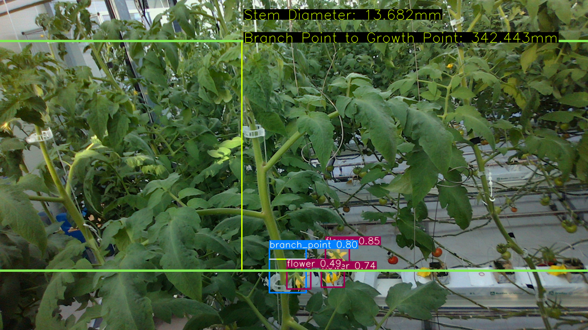

# Plant_growth_measurement

**`Objective`**: To Detect Line and Caculate the Distance Between Growth Point and Top Flower

# Prerequisites and Environment

**`OS`: Ubuntu 18.04**

**`GPU`: NVIDIA GeForce RTX 2070**

**`NVIDIA driver version`: 470.86**

**`CUDA version`: 11.4**

# How to use this repository

1) Firstly, install anaconda and create your own virtual environment as below.

`anaconda version: 4.10.1`

```bash
conda create -n farmbot python=3.8.5
```

2)  `git clone` this repository in your workspace.

```bash
git clone https://github.com/kistvision/Plant_growth_measurement.git
```

3) In the virtual environment, `farmbot` , download the required packages as below. 

```bash
pip install -r requirements.txt
```

or `pip install` the packages described below

```bash
pip install numpy==1.22.1
pip install pyrealsense2==2.49.0.3474
pip install torch==1.7.0
pip install pillow==8.3.1
pip install opencv-python==4.5.3.56
pip install Cython==0.29.24
pip install pycocotools==2.0.0
pip install torchvision==0.8.1
pip install matplotlib==3.4.2
pip install PyYAML==5.4.1
pip install pandas==1.3.1
pip install Ipython==7.26.0
pip install tqdm==4.62.0
```

4) If needed, revise `main.py` file in order to use your own image samples or lively captured images according to the comments written in `main.py`.

```bash
python main.py --source sample/test --output sample/output --img-size 320 --cfg cfg/yolor_p6_custom.cfg
```
Or, you can revise `main.sh` file in order to use above-mentioned parsers more conveniently.

```bash
sh main.sh
```

# Brief guideline for using `main.sh`,
`weights`: You can download our weights through this [Google drive link](https://drive.google.com/file/d/14mTBM5oQsalyUQRwluSlE3VLPD4KiMPU/view?usp=share_link). 

`cfg`: Our model used `yolo_p6_custom.cfg` as configuration file.


``` shell
python main.py \
--weights ./models/best_overall.pt \
--source ./data/testdata \
--output ./outputs \
--conf-thres 0.2 \
--iou-thres 0.5 \
--device 0 \
--agnostic-nms \
--cfg ./yolor/cfg/yolo_p6_custom.cfg\
--names ./data/farmbot.names \
--vertical_focal_len 898.292 \
--horizontal_focal_len 897.507
```

# Result
### Input sample image


### Result of `main.py`

